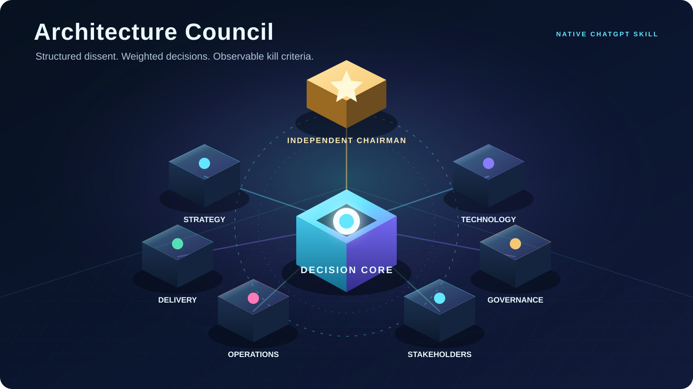
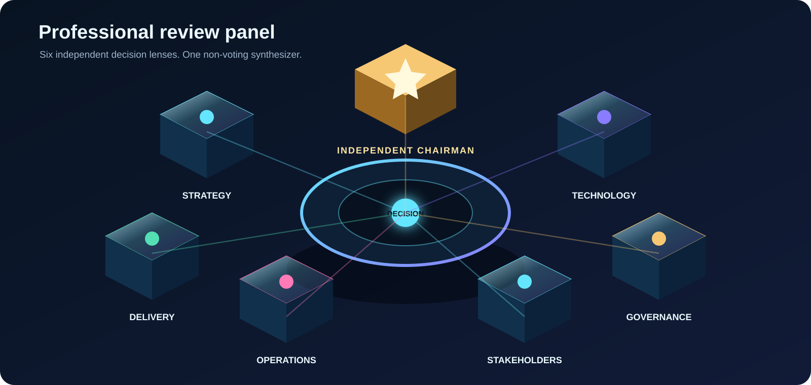
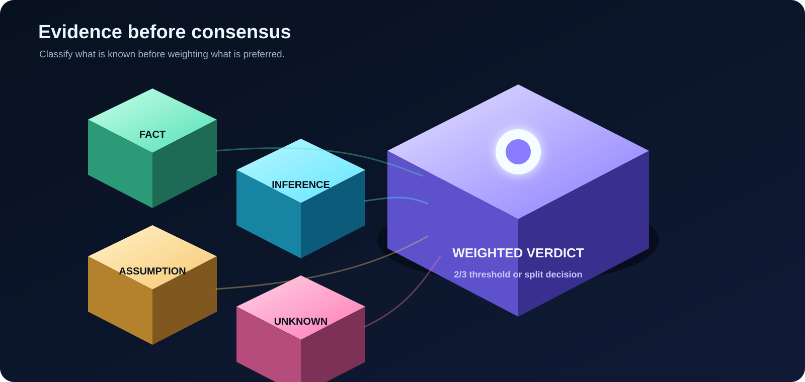
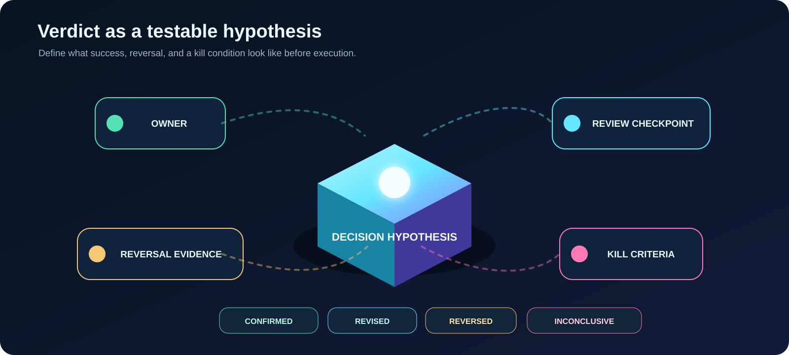

<p align="center">
  
</p>

<h1 align="center">Architecture Council</h1>

<p align="center"><strong>Structured architecture and executive decision-making for high-stakes choices.</strong></p>

<p align="center">
  <strong>Active</strong> · Native ChatGPT Skill · v1.1.0 · MIT License
</p>

<p align="center">
  
</p>

Architecture Council turns consequential decisions into an explicit review process. It separates facts from assumptions, forces independent professional perspectives before synthesis, preserves dissent, applies a confidence-weighted recommendation threshold, records corrective protocol interventions when they are required, and converts the final verdict into an observable decision record with kill criteria and an outcome checkpoint.

The Skill is designed for architecture, cybersecurity, operations, delivery, strategy, governance, customer impact, and other cross-functional decisions where a single-lens answer is not enough.

## Why this exists

High-impact decisions often fail for reasons that are not purely technical. Business value, security, delivery risk, operational simplicity, governance, and stakeholder impact can pull in different directions.

Architecture Council makes those tensions visible instead of flattening them into premature consensus:

- reviewers state independent positions before seeing one another's conclusions;
- material claims are labeled as `FACT`, `INFERENCE`, `ASSUMPTION`, or `UNKNOWN`;
- dissent remains visible in the final decision record;
- recommendation strength depends on weighted support and confidence;
- corrective protocol interventions are recorded separately from normal deliberation and never treated as extra votes;
- every decision ends with exactly one immediate next action, an owner, a review checkpoint, and observable kill criteria.

## Choose the lightest council that can change the outcome

| Mode | Use it when | Review shape |
|---|---|---|
| **Quick Council** | The decision matters, but it is reasonably reversible and three lenses can expose the main risk | Three reviewers |
| **Duo Review** | One core tension defines the decision | Two opposing professional lenses |
| **Full Council** | The decision is high-impact, cross-functional, difficult to reverse, or materially ambiguous | Six reviewers plus the Independent Chairman |

The goal is not to maximize reviewer count. The goal is to expose a disagreement that could change the decision.

## Professional review panel

<p align="center">
  
</p>

| Role | Primary decision lens |
|---|---|
| **Strategic and Business Reviewer** | Business value, priorities, strategic alignment, opportunity cost, and long-term impact |
| **Technical and Security Architect** | Technical correctness, security, resilience, supportability, lifecycle, and technical debt |
| **Delivery and PMO Reviewer** | Scope, dependencies, ownership, sequencing, timeline, acceptance, rollback readiness, and closure |
| **Risk and Governance Reviewer** | Risk, compliance, auditability, decision rights, controls, residual exposure, and rollback governance |
| **Operational Simplicity Reviewer** | Practicality, maintainability, supportability, clarity, and unnecessary complexity |
| **Customer and Stakeholder Reviewer** | Customer impact, communication, commitments, responsibility split, usability, and alignment |
| **Independent Chairman** | Synthesis, weighted tally verification, dissent preservation, kill criteria, and one immediate next action. The Chairman does not vote. |

## Decision flow

<p align="center">
  
</p>

1. Build and validate the Decision Dossier.
2. Select the mode and reviewers before positions exist.
3. Produce independent opening positions.
4. Classify evidence and challenge assumptions.
5. Record any corrective protocol interventions required outside the normal mode flow.
6. Require explicit final stances with confidence and dealbreakers.
7. Calculate confidence-weighted support.
8. Preserve dissent and unresolved questions.
9. Let the Independent Chairman synthesize the verdict, kill criteria, one immediate action, owner, and review checkpoint.

## Evidence and decision model

<p align="center">
  
</p>

Material claims are classified before deliberation:

- `FACT` - directly observed or verified.
- `INFERENCE` - a logical interpretation of facts.
- `ASSUMPTION` - believed to be true but not verified.
- `UNKNOWN` - missing information that could change the decision.

Each reviewer has a base weight. One preselected domain seat may receive a higher base weight when the decision clearly belongs to that domain. Confidence then scales the final stance. A recommendation requires at least two-thirds of total possible base weight. If no option reaches the threshold, the result is a split decision rather than manufactured consensus.

## Protocol intervention observability

Schema 1.1 Decision Records capture corrective work that occurs outside the normal mode-defined flow. Each corrective pass is assigned one primary category: `insufficient_dissent`, `novelty_failure`, `premature_consensus`, `missing_stance`, or `evidence_gap`.

The intervention total must equal the sum of those five categories. These counts are process-quality signals only. They are not model-call counts, provider-dispatch counts, vote weights, or proof of independent-agent execution.

Legacy Decision Records without `schema_version` remain valid as schema 1.0 records for backward compatibility.

## Outcome tracking

<p align="center">
  
</p>

A verdict is treated as a testable hypothesis. Before execution, the decision record captures:

- the recommendation and prediction;
- the owner and review checkpoint;
- success evidence and reversal evidence;
- observable kill criteria;
- protocol intervention metadata for new schema 1.1 records;
- the later outcome as `confirmed`, `revised`, `reversed`, or `inconclusive`.

The original rationale is preserved even when the later outcome changes the recommendation.

## What a complete decision record should answer

A useful output should make it easy for an executive, architect, project manager, or operator to answer five questions:

1. **What are we deciding?**
2. **What evidence supports each option?**
3. **Where do qualified reviewers genuinely disagree?**
4. **What would make us reverse the decision?**
5. **What is the one immediate next action, who owns it, and when do we review the outcome?**

## Use Architecture Council for

- architecture and platform choices with meaningful trade-offs;
- cybersecurity controls with business or operational impact;
- build-vs-buy, provider, hosting, or infrastructure decisions;
- migration and resilience strategies;
- governance or organizational standards;
- decisions with incomplete evidence or material irreversibility;
- cross-functional choices where dissent should remain visible.

For simple factual lookups, routine formatting, or low-cost reversible experiments, use a direct answer instead of convening a council.

## Skill documentation

The canonical Skill source is [`skills/architecture-council/`](skills/architecture-council/).

The human-facing Skill landing page is [`skills/architecture-council/README.md`](skills/architecture-council/README.md). The authoritative trigger and execution behavior remains in [`SKILL.md`](skills/architecture-council/SKILL.md).

## Repository structure

```text
.github/
  ISSUE_TEMPLATE/
  workflows/
docs/
  visual-system.md
scripts/
  build-chatgpt-skill.py
  validate-repository.py
skills/architecture-council/
  README.md
  SKILL.md
  VERSION
  agents/openai.yaml
  assets/
  references/
  scripts/
  tests/
```

## Build and validate

```bash
python scripts/validate-repository.py
python scripts/build-chatgpt-skill.py
```

The distributable package is generated as `dist/skill.zip`.

## Visual system

The repository uses vector-first documentation graphics with a consistent isometric 3D language. Long explanatory copy stays in Markdown rather than being baked into images. See [`docs/visual-system.md`](docs/visual-system.md) for the design and accessibility rules.

A 1280 x 640 social preview asset is available at [`skills/architecture-council/assets/social-preview.svg`](skills/architecture-council/assets/social-preview.svg) for use in GitHub repository settings.

## Security

Do not include credentials, private keys, authentication material, raw customer configurations, or unapproved internal information. Use approved connected environments for internal or sensitive decision dossiers. See [`SECURITY.md`](SECURITY.md).

## Contributing

See [`CONTRIBUTING.md`](CONTRIBUTING.md) before changing the Skill, validation contract, or public documentation.

## Version

Current Skill version: `1.1.0`

## License

See [`LICENSE`](LICENSE) and the bundled third-party license file under `skills/architecture-council/LICENSES/`.
