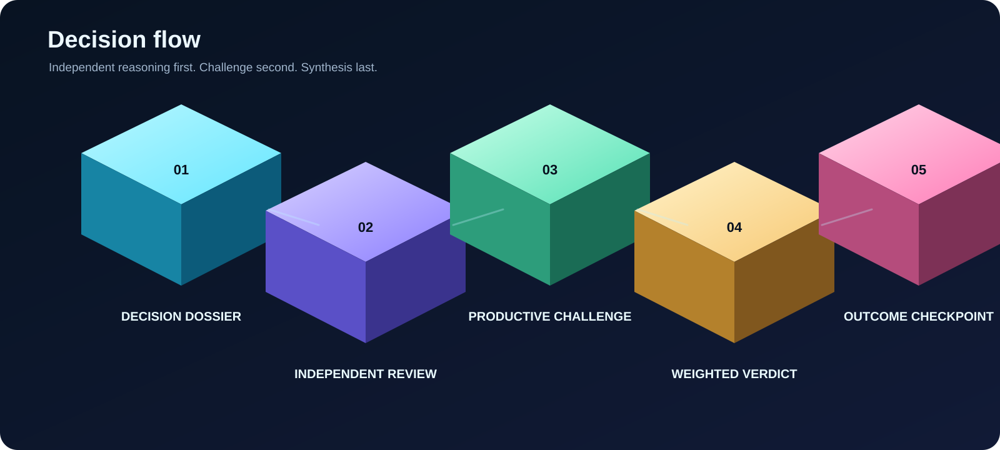

  

<h1 align="center">Architecture Council</h1>

<strong>Turn consequential architecture and executive choices into explicit, reviewable decision records.</strong>

  <strong>Status: Active</strong> · Category: Decision Architecture · Product: ChatGPT · Version: 1.0.2

> This README is the human-facing overview. `SKILL.md` remains the authoritative control-plane definition for triggering and execution behavior.

## What this Skill does

Architecture Council convenes a structured professional review for high-stakes, ambiguous, or cross-functional decisions. It forces independent perspectives before synthesis, classifies evidence explicitly, preserves meaningful disagreement, calculates confidence-weighted support, and turns the final recommendation into a decision record with observable kill criteria and an outcome checkpoint.

The council uses professional operating roles rather than generic personas. The Independent Chairman synthesizes the result and verifies the tally, but does not vote.

## Use this Skill when

Use `@architecture-council` when a decision has one or more of these characteristics:

- material downside if the choice is wrong;
- architecture, security, operational, commercial, governance, or customer trade-offs;
- incomplete evidence that should be made explicit;
- more than one professional discipline can change the answer;
- the decision is difficult or expensive to reverse;
- dissent should be preserved instead of compressed into a simple majority view;
- the implementation needs a defined owner, review checkpoint, and kill criteria.

Do not use it for simple factual lookups, routine formatting, low-cost reversible experiments, or decisions already resolved by an authoritative instruction.

## Core capabilities

- **Mode selection** - chooses Quick Council, Duo Review, or Full Council based on decision impact and reversibility.
- **Decision Dossier** - structures the decision, options, constraints, evidence, authority, risk, sensitivity, and success criteria before debate.
- **Independent review** - generates opening positions before reviewers see one another's conclusions.
- **Evidence classification** - labels material claims as `FACT`, `INFERENCE`, `ASSUMPTION`, or `UNKNOWN`.
- **Productive challenge** - exposes blind spots, challenges assumptions, and requires self-correction where justified.
- **Weighted recommendation** - combines reviewer base weight with confidence and requires at least two-thirds of total possible base weight for a recommendation.
- **Dissent preservation** - keeps minority positions and unresolved questions visible.
- **Kill criteria** - defines observable conditions that should stop, reverse, or materially reconsider the decision.
- **Outcome tracking** - records whether the later result was `confirmed`, `revised`, `reversed`, or `inconclusive` without rewriting the original rationale.

## Typical workflow

1. Build a Decision Dossier.
2. Choose the lightest council mode that can expose a decision-changing disagreement.
3. Select reviewers before any position is known.
4. Run the problem-restatement gate.
5. Produce independent opening positions with evidence labels.
6. Run the mode-specific challenge round.
7. Require one final stance per reviewer with confidence and a dealbreaker.
8. Calculate confidence-weighted support.
9. Let the Independent Chairman synthesize the evidence, tally, dissent, compromise space, kill criteria, exactly one immediate action, owner, and review checkpoint.
10. Validate structured records with the bundled scripts when JSON artifacts are produced.

  

## Expected output

A complete council response should make the following visible:

- the decision and options considered;
- evidence labels for material claims;
- independent reviewer positions;
- disagreements that survived challenge;
- final reviewer stances and confidence;
- the weighted support calculation;
- the Independent Chairman's synthesis;
- the recommendation or explicit split decision;
- minority or dissenting positions;
- kill criteria and reversal evidence;
- exactly one immediate next action;
- a named owner and review checkpoint;
- the actual execution model when isolated agents or provider independence are unavailable.

## Guardrails and boundaries

- `SKILL.md` is authoritative for execution behavior. Documentation changes in this README do not change the Skill's trigger or deliberation rules.
- The council is advisory. A verdict is not authorization to execute a change that still requires formal approval.
- Do not claim provider independence, model independence, or isolated-agent execution unless it was actually verified.
- For sensitive internal, customer, configuration, commercial, contractual, or security material, use only approved connected environments and redact unnecessary identifiers.
- Never include passwords, tokens, private keys, authentication material, or full sensitive configurations.
- Do not force consensus when the weighted threshold is not reached. Return a split decision and preserve the minority position.

## Example prompts

- `@architecture-council Run a Full Council on whether we should standardize this customer design on BGP plus SD-WAN or keep static routing. Preserve dissent and define kill criteria.`
- `@architecture-council Use Duo Review to challenge the security versus operational simplicity trade-off in this proposed remote-access design.`
- `@architecture-council Build a Decision Dossier first, then choose the lightest council mode for this hosting-provider selection.`
- `@architecture-council Review this migration plan from strategy, technical risk, delivery, governance, operations, and stakeholder perspectives. Return exactly one immediate next action.`
- `@architecture-council Revisit this earlier verdict using the observed outcome evidence and classify the result as confirmed, revised, reversed, or inconclusive.`

## Related Skills

This repository contains one authoritative Skill, so there is no sibling Skill to link locally. Do not invent a related Skill merely to fill this section.

## Skill files

| File or directory | Purpose |
|---|---|
| `SKILL.md` | Authoritative trigger and execution instructions used by ChatGPT |
| `VERSION` | Current Skill version |
| `agents/openai.yaml` | Human-readable interface metadata and supported product configuration |
| `assets/icon.svg` | Local Skill icon and visual identity |
| `assets/*-3d.svg` | Vector-first public documentation illustrations |
| `references/` | Decision dossier, reviewer, protocol, security, output, and outcome-tracking rules loaded when needed |
| `scripts/` | Deterministic validators for decision artifacts and the Skill bundle |
| `tests/` | Regression and validation coverage for the Skill contract |
| `CHANGELOG.md` | Skill-level release history |
| `NOTICE.md` and `LICENSES/` | Attribution and bundled third-party licensing material |

## Repository navigation

- [Repository overview](../../README.md)
- [Visual system](../../docs/visual-system.md)
- [Security policy](../../SECURITY.md)
- [Contributing guide](../../CONTRIBUTING.md)
- [Skill changelog](CHANGELOG.md)
- [Authoritative Skill definition](SKILL.md)
